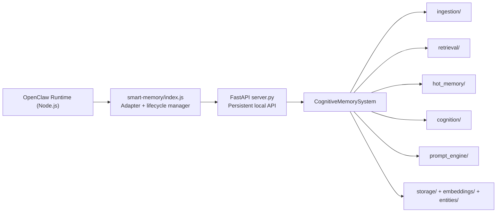
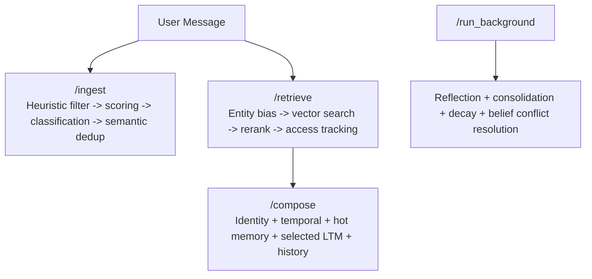

# Smart Memory v2 - Cognitive Architecture for OpenClaw

<p>
  
  
  
  
  
  
</p>

> **Not a basic RAG cache.**  
> Smart Memory v2 is a persistent, local cognitive engine for OpenClaw with schema-versioned long-term memory, hot working memory, background cognition, strict token-bounded prompt composition, and a continuously running FastAPI process.

---

## Quick Value (60 seconds)

| You Need | Smart Memory v2 Gives You |
|---|---|
| Continuity across sessions | Typed long-term memory (`episodic`, `semantic`, `belief`, `goal`) |
| Fast local recall | Nomic embeddings + vector search + reranking |
| Stable context quality | Strict prompt token enforcement with deterministic eviction priority |
| Better long-run memory quality | Semantic dedup, reinforcement, consolidation, decay, and conflict resolution |
| Lightweight installs | CPU-only PyTorch standard (no CUDA wheel bloat) |
| Operational visibility | `/health`, `/memories`, `/memory/{id}`, `/insights/pending` |

---

## Why This Exists

Most memory plugins are retrieval wrappers. They do not behave like cognition.  
Smart Memory v2 is designed as a **cognitive pipeline**:

- `Ingestion`: Decide what is memory-worthy.
- `Retrieval`: Find relevant memories with entity and time bias.
- `Working Memory`: Keep a small, high-signal mind state.
- `Background Cognition`: Reflect, consolidate, decay, and resolve conflicts.
- `Prompt Composition`: Assemble bounded, coherent context for the model.

---

## Architecture At A Glance



### Request Flow



---

## Phase 8 Production Polish

### CPU-Only Standard (lightweight)
- Install now explicitly forces CPU wheels:
- `pip install torch torchvision torchaudio --index-url https://download.pytorch.org/whl/cpu`
- `requirements-cognitive.txt` includes `einops>=0.8.0` for Nomic compatibility.

### Strict Token Enforcement
`max_prompt_tokens` is now hard-enforced at render time. If over budget, eviction happens in this exact order:
1. Oldest conversation history
2. Lower-ranked retrieved memories
3. Insight queue items
4. Working memory
5. Temporal state
6. Agent identity (never evicted)

### Access Tracking Fixed
Selected retrieval memories now persist:
- `last_accessed = now()`
- `access_count += 1`

### Semantic Dedup in Ingestion
Before creating a new memory:
- Embed candidate content
- Search top-1 nearest vector
- If cosine similarity `> 0.85`, skip new memory creation and reinforce existing memory:
- update `last_accessed`
- increment `access_count`
- increment `reinforced_count` for belief memories

### Conflict Resolver Thresholds Relaxed
Belief conflicts are now flagged when:
- beliefs share at least one entity
- and stances or sentiment are opposing

### Observability Endpoints
- `GET /health` includes embedder-loaded status and model/backend metadata
- `GET /memories?type=` lists memory objects (optional type filter)
- `GET /memory/{memory_id}` fetches one memory object
- `GET /insights/pending` inspects pending hot-memory insights

### Prompt Compose Input Improvement
`hot_memory` is optional in `PromptComposerRequest`; a safe default object is used when omitted.

---

## Feature Highlights

### Hybrid Node + Python Design
- OpenClaw stays in Node.
- Heavy cognitive operations run in Python.
- `index.js` is a thin adapter that talks HTTP to `localhost:8000`.

### Cold-Start Prevention
- The adapter launches `uvicorn` once and keeps it alive.
- Nomic embeddings and storage connections remain warm between calls.

### REM-Style Background Cognition
Periodic background cycle handles:
- reflection + associative insights
- memory consolidation
- decay + vector pruning
- belief conflict resolution

### Curiosity Triggers
Associative insight generation computes curiosity from emotional intensity and familiarity.
High-curiosity memories can become proactive working questions.

### Schema-First Memory Objects
- JSON documents validated with Pydantic.
- Schema versioning + entity IDs + relations + emotional metadata.

---

## Memory Layers

| Layer | Purpose | Example Content |
|---|---|---|
| Agent Identity | Stable behavior anchor | role, mission, style |
| Temporal State | Time continuity | current time, last interaction delta, state |
| Hot Memory | Current cognitive focus | active projects, top-of-mind, working questions |
| Long-Term Memory | Durable history | episodic/semantic/belief/goal objects |
| Insight Queue | Background reflections | confidence-scored insight objects |
| Conversation Context | Immediate grounding | recent turns + current user input |

---

## Repository Layout

```text
.
+- server.py
+- cognitive_memory_system.py
+- prompt_engine/
+- ingestion/
+- retrieval/
+- hot_memory/
+- cognition/
+- storage/
+- embeddings/
+- entities/
+- smart-memory/
   +- index.js
   +- postinstall.js
```

---

## Installation

### Option A: ClawHub

```bash
npx clawhub install smart-memory
```

### Option B: From GitHub

```bash
git clone https://github.com/BluePointDigital/smart-memory.git
cd smart-memory/smart-memory
npm install
```

### What `npm install` Does

`postinstall.js` automatically:
1. Creates `.venv` at repository root.
2. Upgrades `pip`.
3. Installs CPU-only PyTorch wheels.
4. Installs `requirements-cognitive.txt` (including FastAPI, sentence-transformers, qdrant-client, einops).

Works on both Windows and Unix path conventions.

---

## How To Use

```js
import memory from "smart-memory";

await memory.start();

await memory.ingestMessage({
  user_message: "I started migrating our database today.",
  assistant_message: "Track risks and rollback strategy.",
  timestamp: new Date().toISOString()
});

const retrieval = await memory.retrieveContext({
  user_message: "How is the migration going?",
  conversation_history: "..."
});

const composed = await memory.getPromptContext({
  agent_identity: "You are a persistent cognitive assistant.",
  conversation_history: "...",
  current_user_message: "Continue from where we left off."
  // hot_memory optional
});

await memory.runBackground(true);
await memory.stop();
```

---

## API Surface

### JavaScript Adapter Methods

| Method | Purpose |
|---|---|
| `init()` / `start()` | Ensure API process is running and healthy |
| `ingestMessage(interaction)` | Send interaction to ingestion pipeline |
| `retrieveContext({ user_message, conversation_history })` | Retrieve ranked memory context |
| `getPromptContext(request)` | Compose final bounded prompt context |
| `runBackground(scheduled)` | Trigger cognition cycle |
| `stop()` | Stop managed Python server process |

### FastAPI Endpoints

| Endpoint | Method | Description |
|---|---|---|
| `/` | `GET` | Basic service status |
| `/health` | `GET` | Health + embedder loaded metadata |
| `/ingest` | `POST` | Ingest incoming interaction |
| `/retrieve` | `POST` | Retrieve relevant long-term memories |
| `/compose` | `POST` | Compose prompt context payload |
| `/run_background` | `POST` | Execute background cognition cycle |
| `/memories` | `GET` | List memories (`?type=` optional) |
| `/memory/{memory_id}` | `GET` | Fetch one memory by ID |
| `/insights/pending` | `GET` | View pending hot-memory insights |

---

## Security and Privacy

- Memory data is designed for local operation.
- `.gitignore` excludes runtime memory stores, virtualenvs, caches, and `node_modules`.
- Review ignored paths before publishing any fork.

---

## Requirements

- Node.js `>=18`
- Python `>=3.11`
- Local disk for model cache + memory storage

---

## License

MIT
